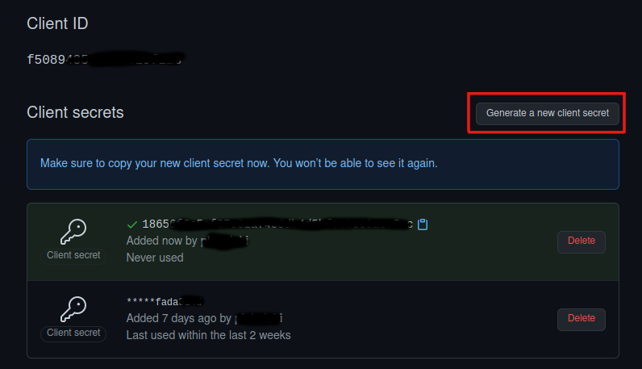

# Deploy

The following instructions assume a fixed IP and domain name for the server to be `cyclone.meling.me`.
Replace the relevant IP address and domain name with your own.
You may also use `127.0.0.1` and self-signed certificates.

## Install Tools for Ubuntu

Here is commands to upgrade `certbot` according to [Certbot instructions](https://certbot.eff.org/lets-encrypt/ubuntufocal-nginx).

```sh
apt-get remove certbot
snap install core
snap refresh core
snap install --classic certbot
ln -s /snap/bin/certbot /usr/bin/certbot
```

## Install Tools for macOS

```sh
% make brew
```

## Configure Fixed IP and Router

Configure NameCheap with your fixed IP; in my case 92.221.105.172 and host name `cyclone`.

```text
Type         Host          Value                TTL
A Record     cyclone       92.221.105.172       5 min
```

Set up port forwarding on Google Home for Heins-Cyclone.
External ports 80/443 maps to internal ports 80/443 for TCP.

## Generate Certbot Private Key and Certificate

```terminal
% sudo certbot certonly --standalone
Saving debug log to /var/log/letsencrypt/letsencrypt.log
Plugins selected: Authenticator standalone, Installer None
Please enter in your domain name(s) (comma and/or space separated)  (Enter 'c'
to cancel): cyclone.meling.me
Requesting a certificate for cyclone.meling.me
Performing the following challenges:
http-01 challenge for cyclone.meling.me
Waiting for verification...
Cleaning up challenges

IMPORTANT NOTES:
 - Congratulations! Your certificate and chain have been saved at:
   /etc/letsencrypt/live/cyclone.meling.me/fullchain.pem
   Your key file has been saved at:
   /etc/letsencrypt/live/cyclone.meling.me/privkey.pem
   Your certificate will expire on 2021-09-11. To obtain a new or
   tweaked version of this certificate in the future, simply run
   certbot again. To non-interactively renew *all* of your
   certificates, run "certbot renew"
```

## Run with Envoy

```bash
% sudo envoy -c envoy-cyclone.yaml
```

## Setting up a Github Application for QuickFeed

Create a new Github app by following the instructions on this [page](https://docs.github.com/en/developers/apps/creating-a-github-app).
The following fields should be specified as follows:

```text
Homepage URL: https://cyclone.meling.me/
Callback URL: https://cyclone.meling.me/auth/github/callback
Request user authorization (OAuth) during installation: Enabled
Webhook Active: Enabled
Webhook URL: https://cyclone.meling.me/hook/github/events
```

An alternative is to replace the `cyclone.meling.me` with `127.0.0.1`, as shown in the picture below.


Create a secret key using the `Generate new client secret` button shown in the picture.
Make sure to copy the client secret key before leaving the page.



Create a new file in the `quickfeed` folder named `cyclone.sh` and insert these line, replacing `client_key` and `client_secret` with the generated key and secret:

```sh
export GITHUB_KEY='client_key'
export GITHUB_SECRET='client_secret'
```

TODO(meling) The following instruction is not necessary to run the server; only for creating a course.

Allow OAuth access by following the instructions on this [page](https://docs.github.com/en/github/setting-up-and-managing-organizations-and-teams/approving-oauth-apps-for-your-organization).

## Build and Run QuickFeed Server

The `webpack` command must be executed after editing files in the `public` folder.
This works while the application is running.

```bash
cd public
webpack
```

Build and run the `quickfeed` server; here we use all default values:

```bash
% go install
% source cyclone.sh
% quickfeed -service.url cyclone.meling.me
```
