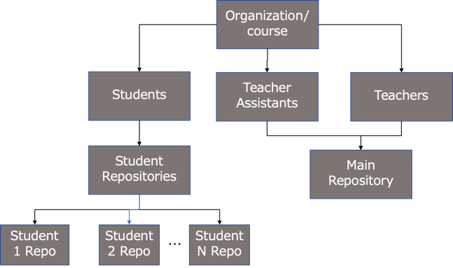
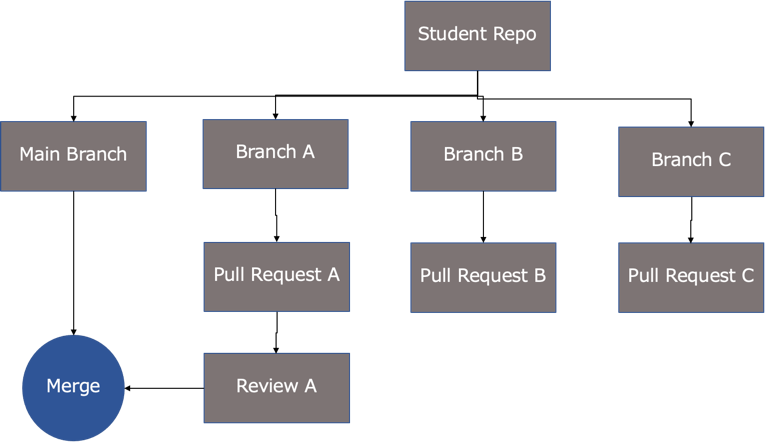
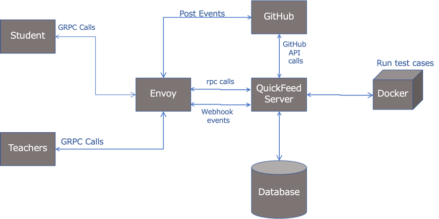

# Quickfeed Support for Feedback via Pull Requests and Issues

## Existing Solution

In the current implementation of QF, each organization (subject) has one `assignment's repository` for each course maintained by the Teacher.
Each Student has a Separate replica `[student-name-labs repository]` of the assignment's repository  on which they work. QF only take code from the main branch of the student to runs test and show results.

#### NOTE : Teacher and Teaching Assistant are considered as one entity throughout this document.

## Required Enhancement

1. Students write code solving an assignment, and create a PR when ready to have it reviewed.
2. Submitted PR is tested and scored by QuickFeed.
3. Reviewers review the PR, which must be approved before QuickFeed records it as approved.

#### Below are the enhancement's that will be implemented.

1. Creation of student repositories.
2. Creation of GitHub issues for the Assignment.
3. Running test cases on student branch.
4. Selecting Pull Request by QF.
5. Adding Reviews to Pull Request
6. Merging Pull Request

## Proposed Solution

#### Creation of student repositories.

1. For each course, teacher will maintain one Assignments Repository. Each student will also have to create a student repository for them to work on the assignment.

#### Creation of GitHub issues for the Assignment.

Each course has multiple assignments. For each assignment, the teacher will create issues on "student-name-labs" repository which has to be solved by students.

##### Choice 1 :

Each assignment will consist of multiple tasks, and for each task Quick Feed will create an issue on a student GitHub Repository. The students should create a PR for every issue created on their repository.

##### Choice 2 :

Another approach, Quick Feed will create only one issue on student repository for all the tasks in an assignment. Therefore, student must create only one pull request per assignment.

##### Challenges with Choice 1:
If there are several tasks in an assignment, it will create individual issues for each task. All students will create pull request for each issue which will lead to creation of multiple pull requests which has to be reviewed by the teacher.

Scenario: If an assignment has 4 tasks, and there are 10 students. There will be 40 pull requests to be reviewed.

##### Challenges with Choice 2:

If there are multiple tasks, the pull request will be long as it contains the solution for all the tasks and is also difficult for the reviewer to review the code.
Also, it will be difficult to differentiate the implementation of each task in the pull request.

NOTE : QF will give both the choices, but the teacher has to choose one of the choice based on their requirement.

#### Running test cases on student branch

1. When a student “push” a new branch to their repository, the Quick Feed will pull the branch and run the test cases. It will also show the result of the test cases on the branch.

#### Selecting Pull Request

To solve an assignment, student has to create PR which closes the issue on their repository. QF will pull the branch and evaluate the student's code by running the test cases. For this to happen, we should specify the following :

•	We must specify a naming convention for the final branch the student wants to do a PR (ex: `studentname_assignment1`).

•	The student must add a specific commit message (ex: final submission) to the PR that must be considered.

•	We can also make it mandatory for the students to add the link of the issue in the PR.

##### Challenges:

If the students label their PR pointing to the wrong issue, essentially claiming to implement a different assignment/task, then this requires that TAs pay attention.

#### Reviews on Pull Request

1. After the deadline and maximum slip days of the assignment, Quick Feed will automatically and randomly add reviewers for each PR. The number of reviewers to be added will depend on the specified policy of the course.
2. One reviewer should always be a Teacher/TA.

The reviewer should have passed the test cases in order to be eligible to review a PR.

A student who is not able to pass the test case will not be allowed to review any PR. But his PR will be reviewed.

We will make sure that the student is not assigned as a reviewer for his own PR.

#### Challenges:

How to grant access to student reviewers without giving full access to reviewee's full codebase.

Solution : create a new repository for each assignment

#### Merging PR
1. We can set some branch rules for merging pull request like required number of reviewers etc

2. We will only add student as a collaborator in their Repositories.

3. If the PR has been reviewed and approved by all the reviewers assigned, either the student or the TA will be able to merge the PR into the main branch.

4. The PR should be approved only if all the test cases are passed.

5. Once the PR is merged, the issue will be closed.

## Architecture

Existing architecture of QuickFeed

